### Why develop fieldRS?
<p align="justify" style="line-height:200%;">
`fieldRS`^[`fieldRS` was developed at the University of Würzburg, Germany, as part of the project Research Network Water in Central Asia (<a href="http://www.cawa-project.net/">CAWa</a>) funded by the German Federal Foreign Office. It is part of the German Water Initiative for Central Asia (the so-called “Berlin process”), which the German Federal Foreign Office launched on 1 April 2008 in order to support peaceful, sustainable and mutually beneficial management of transboundary water resources in Central Asia.] was designed to ease the collection and management of ground truth data. It provides tools that help select sampling sites, correct and pre-process training data and preview classification results.
</p>

</br>

### Example data
<p align="justify" style="line-height:200%;">
`fieldRS` contains several raster and vector datasets that can be used to test its tools:
</p>
* `ndvi` - *RasterStack* with 5 time steps of Normalized Difference Vegetation Index (NDVI) images.

* `fieldData` - *SpatialPolygonsDataFrame* containing ground truth data on crop types.

* `referenceProfiles` - *data.frame* with NDVI profiles for target crop types.

* `roads` - *SpatialLinesDataFrame* object with Open Street Map (OSM) street information.

<p align="justify" style="line-height:200%;">
Most data can be accessed with the `data()` function with the exception of the raster data. This is due to the fact that raster data is stored in the temporary memory when loaded and it can't be saved as an R object. Below we can see how to load each dataset into R.
</p>


```r
data(fieldData) # ground truth data
data(roads) # road shapefile
data(referenceProfiles) # target crop types NDVI profiles
ndvi.ts <- brick(system.file("extdata", "ndvi.tif", package="fieldRS")) # NDVI raster time series
```

</br>

### Selection of sampling sites
<p align="justify" style="line-height:200%;">
When aiming for tasks such as land cover classification we try to sample from as many classes as possible in order to build a representative map. However, this is often made difficult by the lack of knowledge of the target area. When selecting sampling sites randomly, this lack of knowledge can lead us to visit homogeneous places that provide us with little information on the composition of the area we wish to classify. To help better select sampling sites we developed `rankPlots()`. This function uses raster and vector information to prioritize sampling sites based on certain, predefined criteria. As a basis, the function requires a equidistant grid that will define the potential sampling plots. To build this grid we can use the function `derivePlots()`. This function requires an object from which a spatial extent can be derived (e.g. *RasterLayer*, *SpatialPolygonsDataFrame*). Then, based on that extent, the function build a grid of square polygons where its size is predefined by the user. In this example, we will build a grid with 1x1 km polygons. Looking at the output - shown below - we can see that the borders or the image are not considered. This is because those areas result in sampling plots smaller that the target 1x1 km size.
</p>

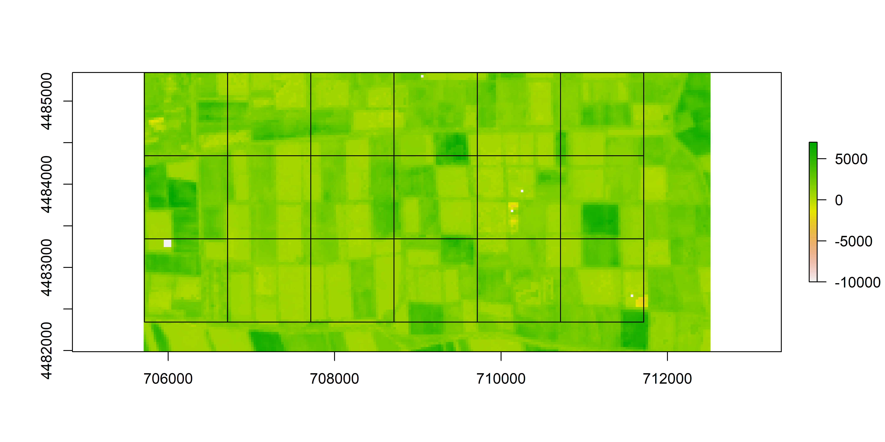

<p align="justify" style="line-height:200%;">
Additionally, `rankPlots()` requires raster information that provides an indication on the composition of the landscape. For example, the user can choose to use an existence land cover classification. However, when we don't have existent information at the spatial scale we wish to derive our own land cover map, it can be useful to build an unsupervised classification. To do this, we will use the `unsuperCLass()` function from the `RStoolbox` package. We will apply a K-means classifier over our NDVI time series and obtain a cluster image with 5 classes.
</p>


```r
k.img <- unsuperClass(ndvi.ts, nSamples=5000, nClasses=5)$map
```

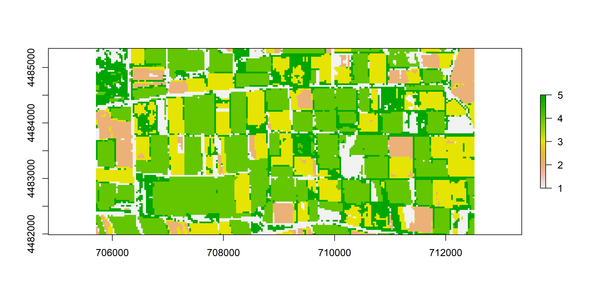

<p align="justify" style="line-height:200%;">
`rankPlots()` will use this unsupervised classification to evaluate the potential land cover composition of the landscape. For each potential sampling plot, it will evaluate its fragmentation based on the number of pixel clumps and their size as well as the number of represented classes. As an additional criteria, `rankPlots()` will allow the inclusion of road information. In practice, the function will evaluate the distance between the closest road and the centre of the sampling plot. In this example, we can use the `roads` variable provided through `fieldRS`.
</p>
<p align="justify" style="line-height:200%;">
Now that we collected all the reference data, we can use `rankPlots()` to identify priority sampling sites using the following criteria:
</p>

* `diversity` - Priority given to the highest class heterogeneity.

* `richness` - Priority given to the highest number of classes.

* `pixel_frequency` - Priority given to the higuest non-NA pixel count.

* `patch_count` - Priority given to the higuest patch count.

* `road_distance` - Priority given to shortest distance.

<p align="justify" style="line-height:200%;">
While the function offers a set of predefined sorting criteria, the user can re-arrange them. Let's show this in action through two test cases. In our first example, we will give priority to the class and patch count. In other words, we will priority the analysis of the unsupervised classification output. In our second example, we will prioritize the distance to the roads. The output will be added to the `plot.grid` shapefile we previously created.
</p>

<table class="table table-responsive" style="margin-left: auto; margin-right: auto;">
 <thead>
  <tr>
   <th style="text-align:center;"> x </th>
   <th style="text-align:center;"> y </th>
   <th style="text-align:center;"> diversity </th>
   <th style="text-align:center;"> richness </th>
   <th style="text-align:center;"> patch.count </th>
   <th style="text-align:center;"> pixel.frequency </th>
   <th style="text-align:center;"> road.distance </th>
   <th style="text-align:center;"> ranking </th>
  </tr>
 </thead>
<tbody>
  <tr>
   <td style="text-align:center;"> 706114.8 </td>
   <td style="text-align:center;"> 4484943 </td>
   <td style="text-align:center;"> 1.411955 </td>
   <td style="text-align:center;"> 1 </td>
   <td style="text-align:center;"> 53 </td>
   <td style="text-align:center;"> 1 </td>
   <td style="text-align:center;"> 1845.245 </td>
   <td style="text-align:center;"> 17 </td>
  </tr>
  <tr>
   <td style="text-align:center;"> 707114.8 </td>
   <td style="text-align:center;"> 4484943 </td>
   <td style="text-align:center;"> 1.424322 </td>
   <td style="text-align:center;"> 1 </td>
   <td style="text-align:center;"> 46 </td>
   <td style="text-align:center;"> 1 </td>
   <td style="text-align:center;"> 1876.150 </td>
   <td style="text-align:center;"> 14 </td>
  </tr>
  <tr>
   <td style="text-align:center;"> 708114.8 </td>
   <td style="text-align:center;"> 4484943 </td>
   <td style="text-align:center;"> 1.335536 </td>
   <td style="text-align:center;"> 1 </td>
   <td style="text-align:center;"> 32 </td>
   <td style="text-align:center;"> 1 </td>
   <td style="text-align:center;"> 1840.659 </td>
   <td style="text-align:center;"> 18 </td>
  </tr>
  <tr>
   <td style="text-align:center;"> 709114.8 </td>
   <td style="text-align:center;"> 4484943 </td>
   <td style="text-align:center;"> 1.449922 </td>
   <td style="text-align:center;"> 1 </td>
   <td style="text-align:center;"> 39 </td>
   <td style="text-align:center;"> 1 </td>
   <td style="text-align:center;"> 1916.704 </td>
   <td style="text-align:center;"> 15 </td>
  </tr>
  <tr>
   <td style="text-align:center;"> 710114.8 </td>
   <td style="text-align:center;"> 4484943 </td>
   <td style="text-align:center;"> 1.380475 </td>
   <td style="text-align:center;"> 1 </td>
   <td style="text-align:center;"> 40 </td>
   <td style="text-align:center;"> 1 </td>
   <td style="text-align:center;"> 2439.187 </td>
   <td style="text-align:center;"> 9 </td>
  </tr>
</tbody>
</table>

<table class="table table-responsive" style="margin-left: auto; margin-right: auto;">
 <thead>
  <tr>
   <th style="text-align:center;"> x </th>
   <th style="text-align:center;"> y </th>
   <th style="text-align:center;"> diversity </th>
   <th style="text-align:center;"> richness </th>
   <th style="text-align:center;"> patch.count </th>
   <th style="text-align:center;"> pixel.frequency </th>
   <th style="text-align:center;"> road.distance </th>
   <th style="text-align:center;"> ranking </th>
  </tr>
 </thead>
<tbody>
  <tr>
   <td style="text-align:center;"> 706114.8 </td>
   <td style="text-align:center;"> 4484943 </td>
   <td style="text-align:center;"> 1.411955 </td>
   <td style="text-align:center;"> 1 </td>
   <td style="text-align:center;"> 53 </td>
   <td style="text-align:center;"> 1 </td>
   <td style="text-align:center;"> 1845.245 </td>
   <td style="text-align:center;"> 14 </td>
  </tr>
  <tr>
   <td style="text-align:center;"> 707114.8 </td>
   <td style="text-align:center;"> 4484943 </td>
   <td style="text-align:center;"> 1.424322 </td>
   <td style="text-align:center;"> 1 </td>
   <td style="text-align:center;"> 46 </td>
   <td style="text-align:center;"> 1 </td>
   <td style="text-align:center;"> 1876.150 </td>
   <td style="text-align:center;"> 15 </td>
  </tr>
  <tr>
   <td style="text-align:center;"> 708114.8 </td>
   <td style="text-align:center;"> 4484943 </td>
   <td style="text-align:center;"> 1.335536 </td>
   <td style="text-align:center;"> 1 </td>
   <td style="text-align:center;"> 32 </td>
   <td style="text-align:center;"> 1 </td>
   <td style="text-align:center;"> 1840.659 </td>
   <td style="text-align:center;"> 13 </td>
  </tr>
  <tr>
   <td style="text-align:center;"> 709114.8 </td>
   <td style="text-align:center;"> 4484943 </td>
   <td style="text-align:center;"> 1.449922 </td>
   <td style="text-align:center;"> 1 </td>
   <td style="text-align:center;"> 39 </td>
   <td style="text-align:center;"> 1 </td>
   <td style="text-align:center;"> 1916.704 </td>
   <td style="text-align:center;"> 16 </td>
  </tr>
  <tr>
   <td style="text-align:center;"> 710114.8 </td>
   <td style="text-align:center;"> 4484943 </td>
   <td style="text-align:center;"> 1.380475 </td>
   <td style="text-align:center;"> 1 </td>
   <td style="text-align:center;"> 40 </td>
   <td style="text-align:center;"> 1 </td>
   <td style="text-align:center;"> 2439.187 </td>
   <td style="text-align:center;"> 9 </td>
  </tr>
</tbody>
</table>

<p align="justify" style="line-height:200%;">
Now let's plot and compare the output grids coloured by the ranking. Below we can see the output for example 1 (above) and example 2 (below).
</p>

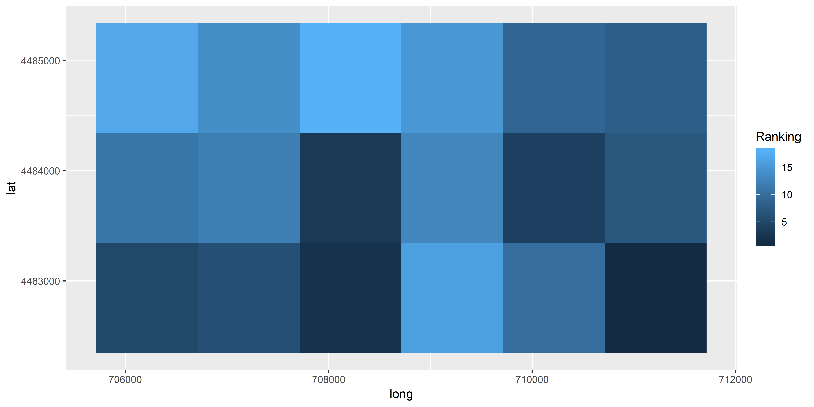

</br>

### Automated field extraction
<p align="justify" style="line-height:200%;">
Once we identify target sampling sites we can `fieldRS` to select concrete polygons to sample from. For example, if our aim is to map crop types, these polygons might coincide with field parcels. To extract these areas we are going to combine `ccLabel()`and `extractFields()`. `ccLabel()` will allow us to segment a raster image based on the difference between neighbouring pixels. The function will call the `mape()` function and, for each pixel, will estimate the Mean Absolute Percent Deviation (MAPE) between it and its immediate neighbours using a 3x3 moving window. After iterating through all the pixels in a raster image, the function will apply a user defined threshold to identify breaks between neighbouring field parcels and label each of them using the function `clump()` from the `raster` package. In this example, we will use a change threshold of 5%. This means that a pixel will be split from its neighbour if the difference between its value is equal or higher than 5% when compared against the mean estimated between itself and its neighbours. We will perform this analysis over a maximum NDVI composite estimate with `ndvi.ts`.
</p>


```r
ndvi.max <- calc(ndvi.ts, max, na.rm=TRUE) # derive maximum NDVI composite)
seg.img <- ccLabel(ndvi.max, method="spatial", change.threshold=5)$regions # segment NDVI image
```

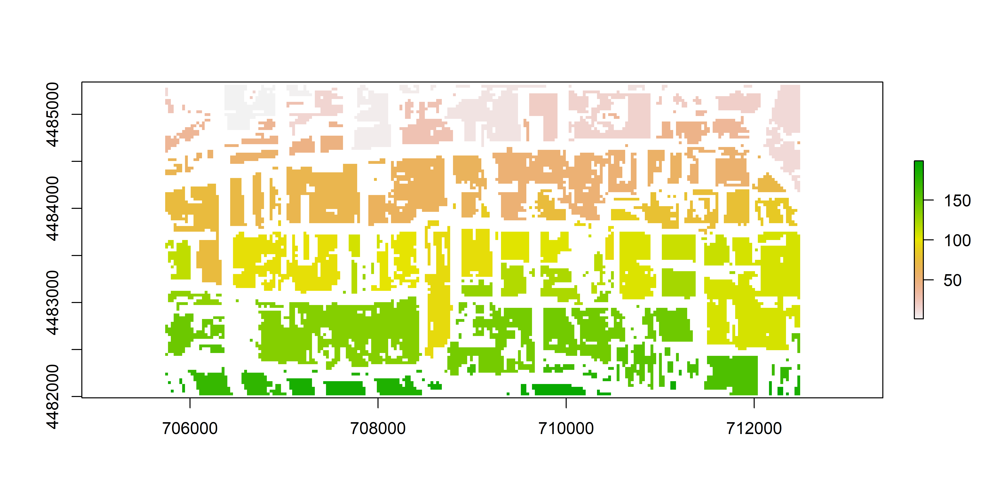

<p align="justify" style="line-height:200%;">
Now we can `pixFilter()` to apply a erosion filter that removes small clumps likely related to mixed-pixels.
</p>


```r
seg.img <- pixeFilter(seg.img, "erosion")
```


<p align="justify" style="line-height:200%;">
Finally, we will use `extractFields()` to derive polygons for each segment. This function will draw a polygon based on the extent of each segment. This can be useful when dealing with noisy images as the ones used in this example. However, as the plot below shows, the output might still require some manual editing.
</p>


```r
fields <- extractFields(seg.img)
```

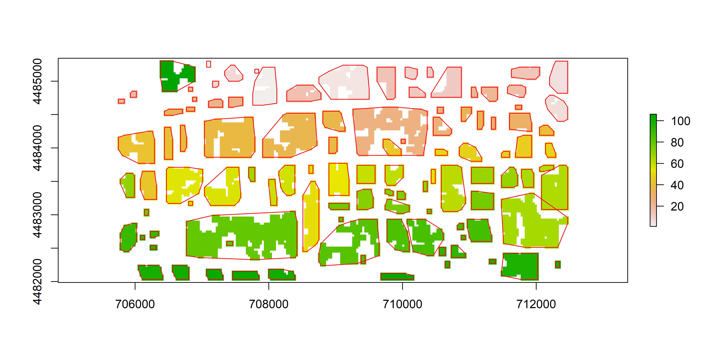

<p align="justify" style="line-height:200%;">
The default approach used by `extractFields()` to draw polygons is the convex hull method, implemented in the `chull()` function. This is named as the "simple" method in this function. Additionally, the function offers a "complex" approach that applies the concave hull method, implemented in the `concaveman()` function of the package with the same name. As shown below, the concave hull approach is a bit more precise. However, it is also more time consuming.
</p>


```r
fields <- extractFields(seg.img, method="complex")
```

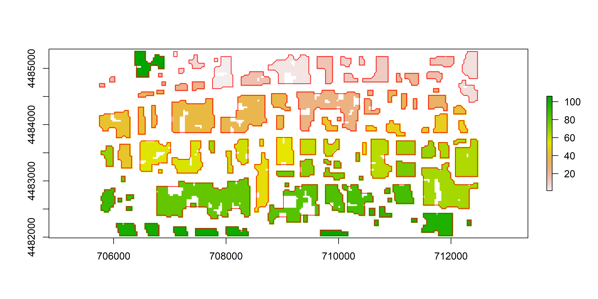

</br>

### Check field samples
<p align="justify" style="line-height:200%;">
Once we collect our field data we will often notice some inconsistencies. This is quite common when collecting categorical data be it either due to misspellings or due to the occasional capitalization of labels. When processing the field data in platforms such as R, this can be problematic since misspelled words will be treated as new classes. To aid in solving such issues we developed `labelCheck()`. First, we provide the function with a vector of the original labels prompting the function to report on the unique classes and on their frequency distribution.
</p>


```r
unique.crop <- labelCheck(fieldData$crop)
unique.crop$labels # show unique labels
#> [1] "wheat"     "cotton"    "bare land"
```

<table class="table table-responsive" style="margin-left: auto; margin-right: auto;">
 <thead>
  <tr>
   <th style="text-align:left;">   </th>
   <th style="text-align:center;"> count </th>
   <th style="text-align:center;"> label </th>
  </tr>
 </thead>
<tbody>
  <tr>
   <td style="text-align:left;"> wheat </td>
   <td style="text-align:center;"> 17 </td>
   <td style="text-align:center;"> wheat </td>
  </tr>
  <tr>
   <td style="text-align:left;"> cotton </td>
   <td style="text-align:center;"> 14 </td>
   <td style="text-align:center;"> cotton </td>
  </tr>
  <tr>
   <td style="text-align:left;"> bare land </td>
   <td style="text-align:center;"> 4 </td>
   <td style="text-align:center;"> bare land </td>
  </tr>
</tbody>
</table>

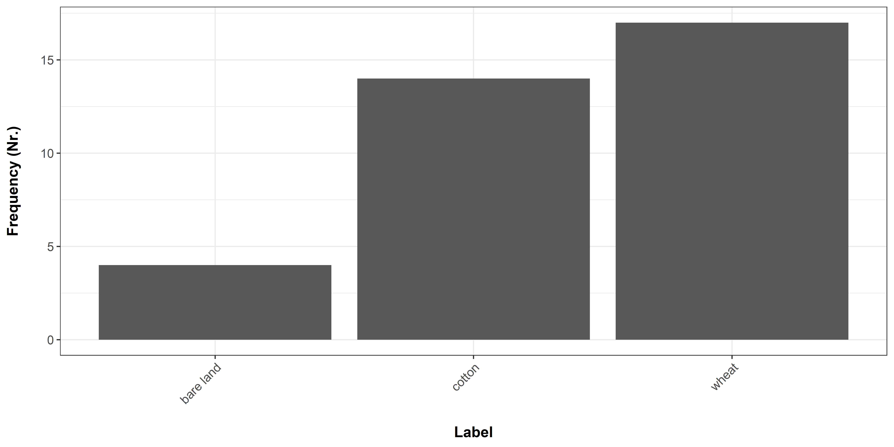

<p align="justify" style="line-height:200%;">
The output shows us three classes: "bare land", "cotton" and "wheat". Additionally, we can see that there are no misspellings. Now, for the purpose of this example, let's assume we only wish to classify wheat. For this reason, let's set all the other samples (i.e. "bare land" and "cotton") to "not-wheat". `labelCheck()` will do this for us. But we need to provide a vector with the corrected unique labels that will be compared against the unique labels reported by the function. This way, the slot `labels` will provide the corrected labels instead of the unique values. We can assign this output to the `fieldData`. Additionally, it will offer us a statistical account of the samples as done before based on the new classes.
</p>


```r
corrected.labels <- labelCheck(fieldData$crop, unique.crop$labels, c("wheat", "not-wheat", "not-wheat"))
fieldData$crop_2 <- corrected.labels$labels
```

<table class="table table-responsive" style="margin-left: auto; margin-right: auto;">
 <thead>
  <tr>
   <th style="text-align:left;">   </th>
   <th style="text-align:center;"> count </th>
   <th style="text-align:center;"> label </th>
  </tr>
 </thead>
<tbody>
  <tr>
   <td style="text-align:left;"> wheat </td>
   <td style="text-align:center;"> 17 </td>
   <td style="text-align:center;"> wheat </td>
  </tr>
  <tr>
   <td style="text-align:left;"> not-wheat </td>
   <td style="text-align:center;"> 18 </td>
   <td style="text-align:center;"> not-wheat </td>
  </tr>
</tbody>
</table>

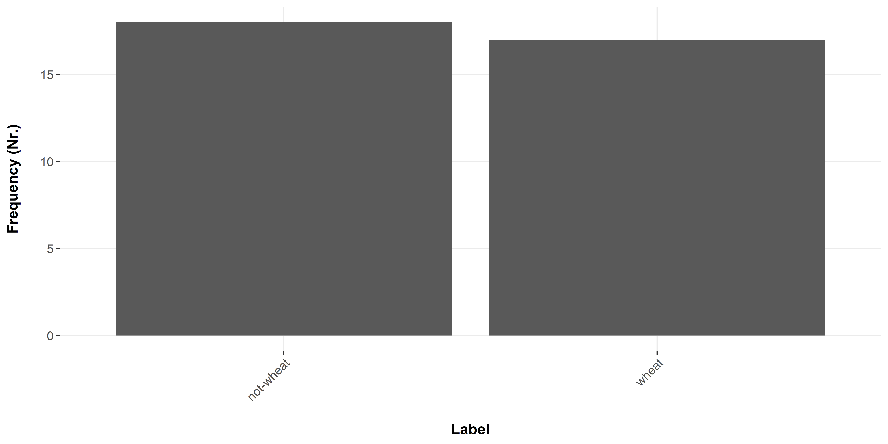

</br>

### Translating field data to samples
<p align="justify" style="line-height:200%;">
After collecting field data we need to translate it into usable samples. `fieldRS` offers tools to extract the pixels overlapping with the ground-truth data and evaluate their consistency. For example, if we are dealing with vectorized polygons, the pixels located along the borders of the polygons can be misleading. For example, if we are dealing with crop mapping, the spectral signature of border pixels can portrait neighbouring fields with different crop types. To aid on the selection of usable pixels we can use `poly2sample()`. For each polygon, the function will identify the overlapping pixels and, for each pixel, will quantify the percentage of its area that is overlapping with the polygon. Using this information, the user can easily ignore mixed pixels. In this example, we will prompt the function to filter out all the pixels with a percent cover lower than 50%.  
</p>


```r
samples1 <- poly2sample(fieldData, seg.img, min.cover=50)
```


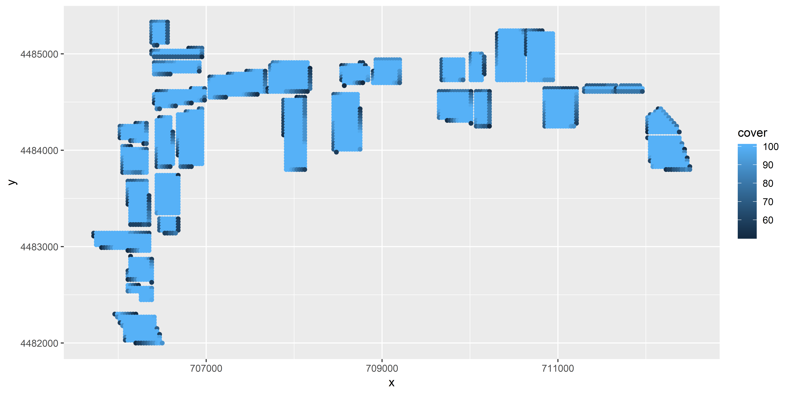

<p align="justify" style="line-height:200%;">
As an alternative, we might choose to label pixel clumps directly. In this case, we can use `raster2sample()`. This function is considerably faster than `poly2sample()`. For each pixel, it applies a 3x3 moving window to quantify the number of non-NA pixels. This can be useful to identify pure samples (i.e. pixels with values close to 1) as well as exclude samples that are likely related to mixed pixels (i.e. pixels with values close to 0).</p>


```r
samples2 <- raster2sample(seg.img)
```

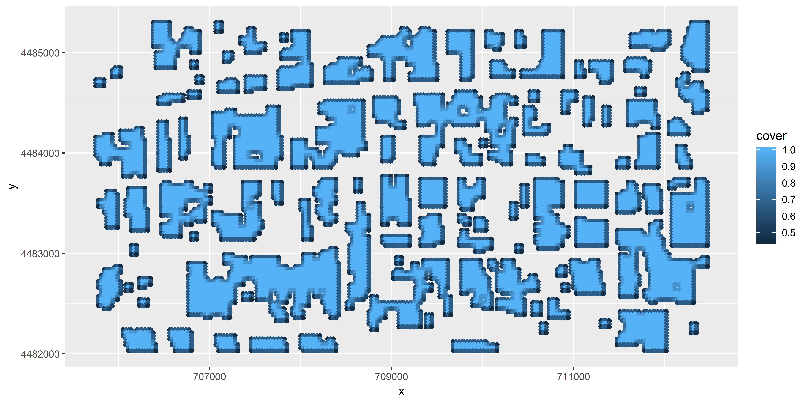

</br>

### Finding sampling mistakes through machine-learning
<p align="justify" style="line-height:200%;">
Before we derive a classified map it can be useful to first visualize the performance of a predictive model using our training data. This can be useful to evaluate the need for more samples. But it also tells us something about the quality of our samples. Knowing which samples were not successfully predicted can point us in the direction of polygons that were poorly drawn or labelled. To address this need, we can use `classModel()`. This function provides a wrapper for the `train()` function of the `caret` package. Just as in `train()`, our function requires a `data.frame` with training data and a `numeric vector` with the target categorical/continuous variable. In addition, `classMove()` allows us to provide vector that groups the samples. This can be the unique identifier of each polygon that is associated to each sample as returned by `poly2sample()` and `raster2sample()`. Let's consider the output of the first. We will use `classModel()` with `Random Forest`classifier to classify the crop types in `fieldData` relabelled in a previous step (i.e. "wheat" and "no-wheat"). As predictors, we will use `ndvi.ts`. Given that this operation can be time consuming for a large amount of samples, we will average the samples for each polygon across each layer in `ndvi.ts` using `apply()`.
</p>


```r
predictor.df <- as.data.frame(extract(ndvi.ts, samples1)) # extracted values
ids <- unique(samples1$id) # polygon id's
predictor.df <- do.call(rbind, lapply(ids, function(u) {
  i <- which(samples1$id == u)
  return(as.vector(apply(predictor.df[i,], 2, mean, na.rm=TRUE)))})) # summarize on field level
crop.types <- fieldData$crop_2[ids] # crop type vector
predictive.model <- classModel(as.data.frame(predictor.df), crop.types, ids)
```


### Finding sampling mistakes through machine-learning
<p align="justify" style="line-height:200%;">
For each class, the function identified the corresponding polygons and iterated through each polygon keeping it for validation while using the remaining ones for training. Then, the function recorded if the class of this polygon was successfully predicted. Finally, for each class, the function derived an aggregated F1-score - based on all true and false positives and negatives - and reported on the accuracy of each polygon. Below we can see the results of this anlysis. polygons colored red in the plot weren't successfully predicted by the classifier.
</p>

<table class="table table-responsive" style="margin-left: auto; margin-right: auto;">
 <thead>
  <tr>
   <th style="text-align:center;"> class </th>
   <th style="text-align:center;"> accuracy </th>
  </tr>
 </thead>
<tbody>
  <tr>
   <td style="text-align:center;"> wheat </td>
   <td style="text-align:center;"> 0.8235294 </td>
  </tr>
  <tr>
   <td style="text-align:center;"> not-wheat </td>
   <td style="text-align:center;"> 0.5882353 </td>
  </tr>
</tbody>
</table>

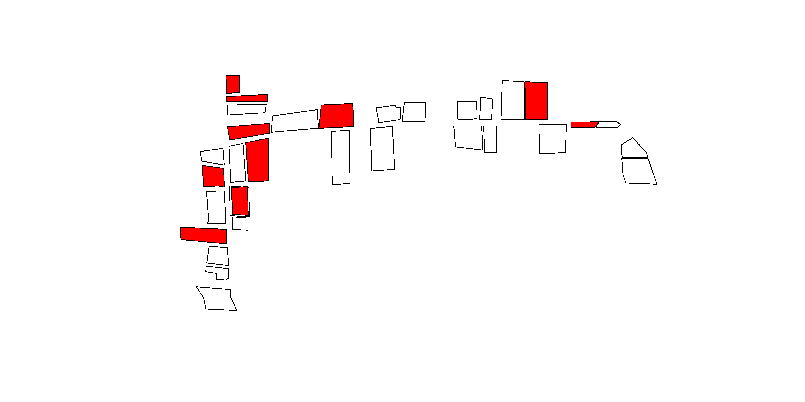
